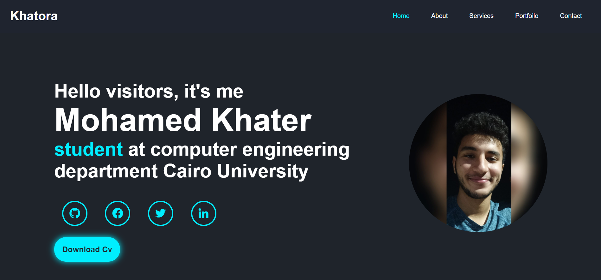

# Resume generator 
## what services you can have?
- **PDF Resume**
- **Cover Letter**
- **Portfolio**
## what you should do to have our services
Our services are free, first you should create an email then sign in our website 
## what pages the website consists of?
- About
- Home
- cover letter
- portofolio website
- a page for resume
## how to run the code?
1. To run the project all you need to do is open Creator folder in VS code or any similar IDE
2. Open the terminal and run command $ npm install wait for the packages to be installed
3. Run command $ npm start and Voila, Enjoy

## Portfolio
you can build a website having your personal data.

First Click Create my portofolio 

**then enter some data**

- **personal info** 

- **social links** 

- **number of projects** 

- **info about projects** 

**Easy GIU try it!**

